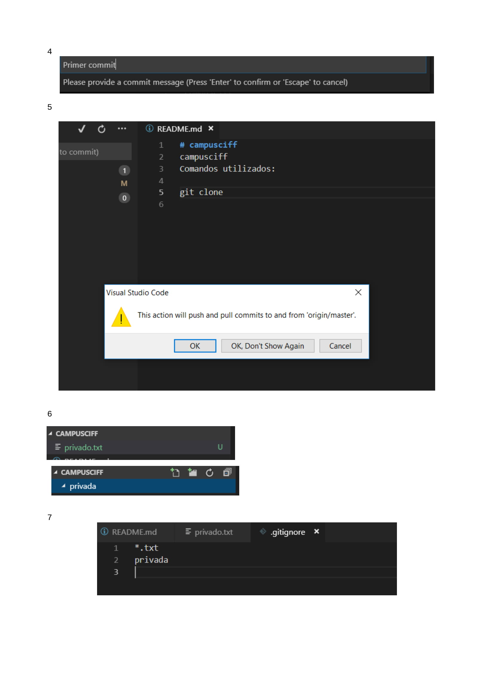
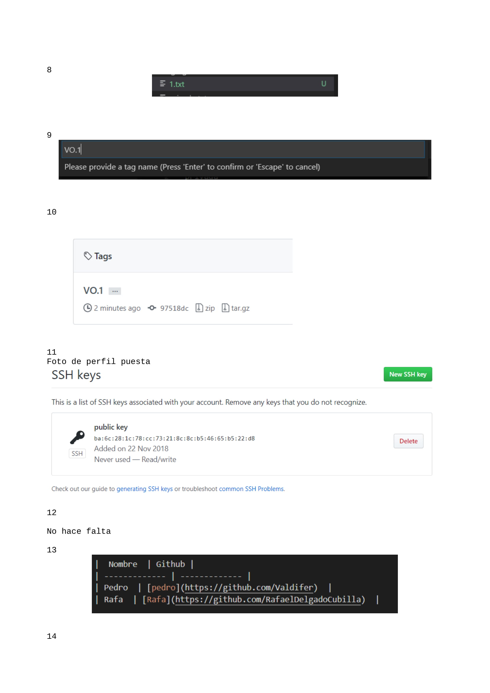
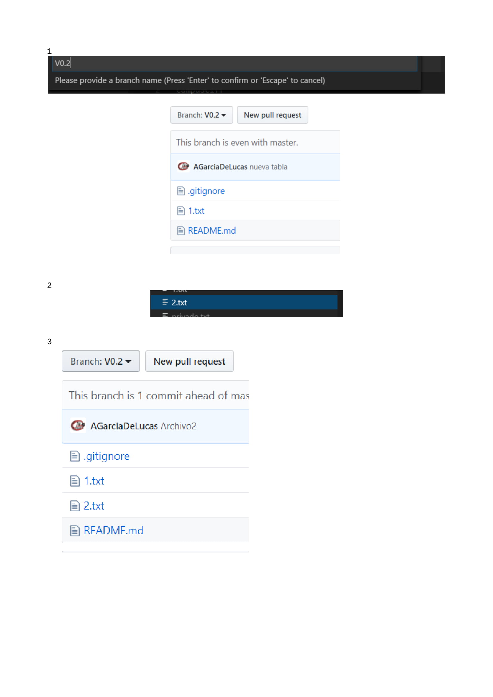
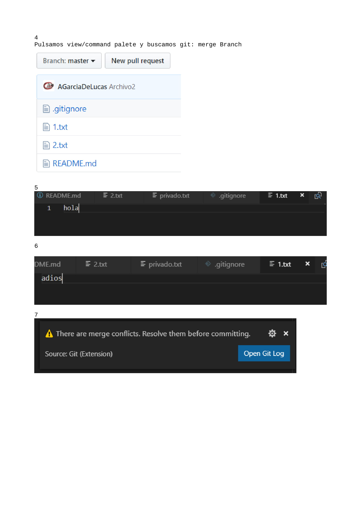

# campusciff
campusciff
Comandos utilizados:

git clone

|  Nombre  | Github |
| ------------- | ------------- |
| Pedro  | [pedro](https://github.com/Valdifer)  |
| Rafa  | [Rafa](https://github.com/RafaelDelgadoCubilla)  |

